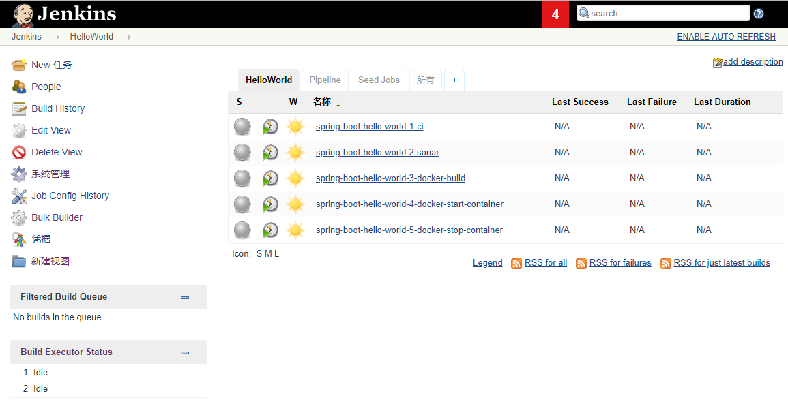
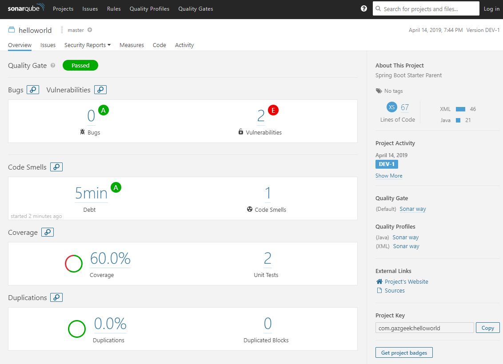
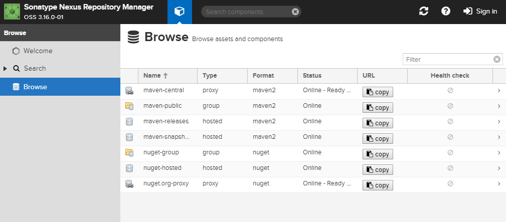

# one-ci

This repo will help to install CI/CD environments with one command on Linux

## Prerequisites:
Docker & docker compose

You can reffer to https://github.com/shikunwei/centos-setup.git to setup Docker & docker compose

## disable firewall
systemctl stop firewalld.service && systemctl disable firewalld.service

## set vm.max_map_count
echo 'vm.max_map_count=262144' >> /etc/sysctl.conf

sysctl -w vm.max_map_count=262144

## How to run:
```
git clone https://github.com/shikunwei/one-ci.git && cd one-ci
git submodule init && git submodule update && docker-compose up -d
```

## Access Tools after service running up:


| *Tool* | *Link* | *Credentials* |
| ------------- | ------------- | ------------- |
| Jenkins | http://${docker-machine ip default}:18080/ | no login required |
| SonarQube | http://${docker-machine ip default}:19000/ | admin/admin |
| Nexus | http://${docker-machine ip default}:18081/nexus | admin/admin123 |
| GitLab | http://${docker-machine ip default}/ | set needed |
| Selenium Grid | http://${docker-machine ip default}:4444/grid/console | no login required |
| Hello World App | http://${docker-machine ip default}:48080/currentSessions | no login required |

DISABLED: GitLab takes too much memory and CPU. Demo uses GitHub repositories instead.

### Jenkins Jobs

There are several jobs preconfigured in Jenkins.
The Jobs cover the following tasks:

- Continuous Integration Build with Maven
- Unit Tests
- Static Source Analysis results are stored in SonarQube
- JaCoCo Test Coverage
- Deployment to Nexus
- Build docker image

## screenshots

### Jenkins Pipeline



### SonarQube Dashboard



### Nexus Repository


